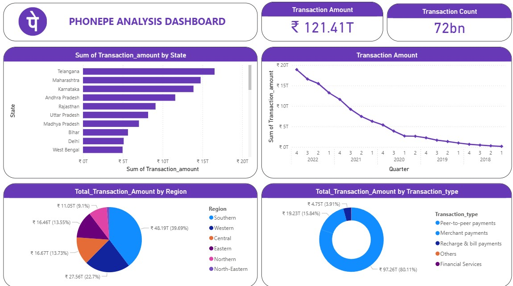

  <h1>📊 PhonePe Pulse Analysis Dashboard</h1>

  

    This project presents a <strong>PhonePe Pulse Analysis Dashboard</strong>, built in 
    <strong>Power BI</strong> using data imported from an <strong>Excel file</strong>. 
    The dataset provides insights into <strong>digital payment trends</strong> in India 
    between <strong>2018–2022</strong>, showcasing the growth of UPI transactions across 
    states, regions, and transaction types.
  

  <h2>📌 Project Overview</h2>
  

    PhonePe Pulse is a first-of-its-kind initiative in India that showcases data about 
    <strong>₹2000+ crore transactions</strong> by consumers. This project analyzes the dataset 
    and visualizes it in an interactive dashboard to uncover <strong>patterns, trends, and insights</strong> 
    into India’s digital payment ecosystem.
  

  <h2>🚀 Features</h2>
  <ul>
    <li>📈 Transaction Trends (2018–2022) – Quarterly analysis of transaction volumes and amounts.</li>
    <li>🗺️ State-wise Performance – Comparison of total transactions across states.</li>
    <li>🌍 Regional Insights – Distribution across Southern, Western, Central, Eastern, Northern, and North-Eastern regions.</li>
    <li>💳 Transaction Types – Breakdown into Peer-to-peer payments, Merchant payments, Recharge &amp; bill payments, Financial services, and Others.</li>
    <li>📊 Interactive Dashboard – Built with Power BI for better decision-making.</li>
  </ul>

  <h2>📂 Dataset</h2>
  <ul>
    <li><strong>Source:</strong> PhonePe Pulse (official data portal)</li>
    <li><strong>Duration:</strong> 2018 – 2022</li>
    <li><strong>Coverage:</strong> All Indian states and regions</li>
    <li><strong>Metrics:</strong> Transaction count, transaction amount, transaction types</li>
  </ul>

  <h2>🛠️ Tools &amp; Technologies</h2>
  <ul>
    <li><strong>Excel</strong> – Used as data source</li>
    <li><strong>Power BI</strong> – For data import, transformation (cleaning &amp; preparation), and visualization</li>
    <li><strong>GitHub</strong> – For project hosting and collaboration</li>
  </ul>

  <h2>📁 Project Structure</h2>
  <pre><code>PhonePe-Pulse-Dashboard/
│── data/
│   └── phonepe_pulse_data.xlsx        # Excel dataset (imported into Power BI)
│
│── images/
│   ├── logo.png                       # PhonePe logo
│   └── Dashboard.jpg                  # Dashboard preview image
│
│── dashboard/
│   └── phonepe_dashboard.pbix         # Power BI dashboard file
│
│── README.md                          # Project documentation
</code></pre>

  <h2>📸 Dashboard Preview</h2>
  

    
  

  <h2>📊 Key Insights</h2>
  <ul>
    <li><strong>₹121.41 Trillion</strong> total transaction value across <strong>72 billion</strong> transactions.</li>
    <li>Southern region contributes the <strong>highest share (~40%)</strong> of transaction value.</li>
    <li>Peer-to-peer payments dominate with <strong>80% share</strong> of transactions.</li>
    <li>Telangana, Maharashtra, and Karnataka are the <strong>top-performing states</strong>.</li>
  </ul>

  <h2>📌 How to Use</h2>
  <ol>
    <li>Clone this repository:
      <pre><code>git clone  https://github.com/varshabsamuel18/phonepe-analysis-excel-powerbi-visualization.git</code></pre>
    </li>
    <li>Open the <code>phonepe_dashboard.pbix</code> file in <strong>Power BI Desktop</strong>.</li>
    <li>Make sure the dataset (<code>phonepe_pulse_data.xlsx</code>) is available in the <strong>data/</strong> folder.</li>
    <li>Refresh the data in Power BI if needed.</li>
    <li>Explore transaction trends across years, states, regions, and transaction types.</li>
  </ol>

</body>
</html>
